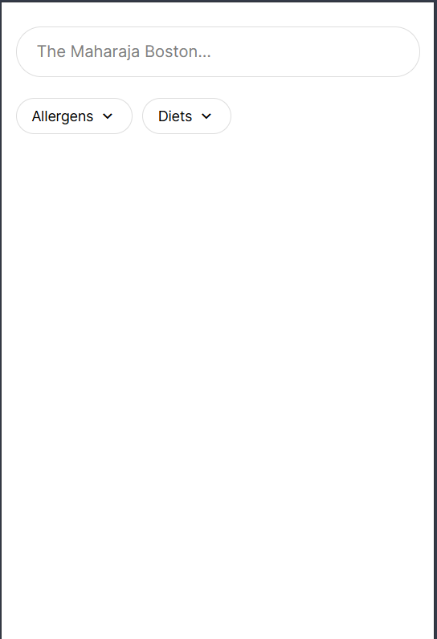
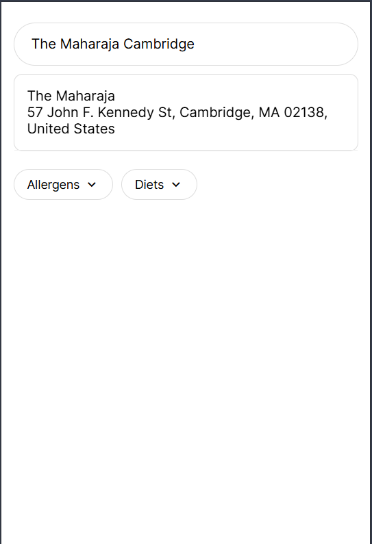
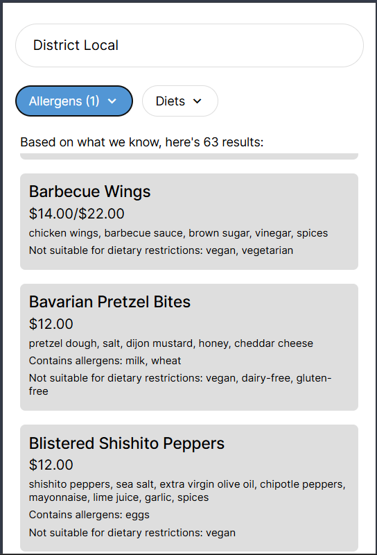

# Welcome to ANOMO

ANOMO (Allergy No More) is a mobile application that tells you what dishes you can and cannot eat at a restaurant given your allergies and dietary restrictions.

## Our Inspiration
We started ANOMO because of the struggles we faced going out to eat with loved ones who have allergies and dietary restrictions. Going to a restaurant without first scoping out the menu is risky, and even if you do check out the menu its hard to tell just how many options are suitable for you.

ANOMO aims to make it easier for you to find options for places to eat and dishes to enjoy no matter your restrictions!

## Our Vision
Our vision is to find a meal that you're excited about. Gone are the days of compromise and disappointment now that you know exactly what options you have anywhere you go.

## Road Map
There are an infinite number of features and improvements we'd like to make, but here are just a few of the next best things to come:
1. QR Code scanning - for scanning menu QR codes when you're already at the restaurant
1. User accounts - so that you can save your favorite dishes
1. Review integration - leave reviews and also use reviews to provide real user feedback
1. Maps integration - for a more familiar browsing experience

## Experience

App on load:



Searching for restaurants:



View results:




---


# Project Setup


This is an [Expo](https://expo.dev) project created with [`create-expo-app`](https://www.npmjs.com/package/create-expo-app).

## Get started

1. Install dependencies

   ```bash
   npm install
   ```

2. Start the app

   ```bash
   npx expo start
   ```

In the output, you'll find options to open the app in a

- [development build](https://docs.expo.dev/develop/development-builds/introduction/)
- [Android emulator](https://docs.expo.dev/workflow/android-studio-emulator/)
- [iOS simulator](https://docs.expo.dev/workflow/ios-simulator/)
- [Expo Go](https://expo.dev/go), a limited sandbox for trying out app development with Expo

You can start developing by editing the files inside the **app** directory. This project uses [file-based routing](https://docs.expo.dev/router/introduction).

## Get a fresh project

When you're ready, run:

```bash
npm run reset-project
```

This command will move the starter code to the **app-example** directory and create a blank **app** directory where you can start developing.

## Learn more

To learn more about developing your project with Expo, look at the following resources:

- [Expo documentation](https://docs.expo.dev/): Learn fundamentals, or go into advanced topics with our [guides](https://docs.expo.dev/guides).
- [Learn Expo tutorial](https://docs.expo.dev/tutorial/introduction/): Follow a step-by-step tutorial where you'll create a project that runs on Android, iOS, and the web.

## Join the community

Join our community of developers creating universal apps.

- [Expo on GitHub](https://github.com/expo/expo): View our open source platform and contribute.
- [Discord community](https://chat.expo.dev): Chat with Expo users and ask questions.
